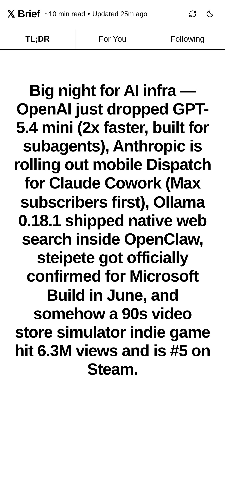
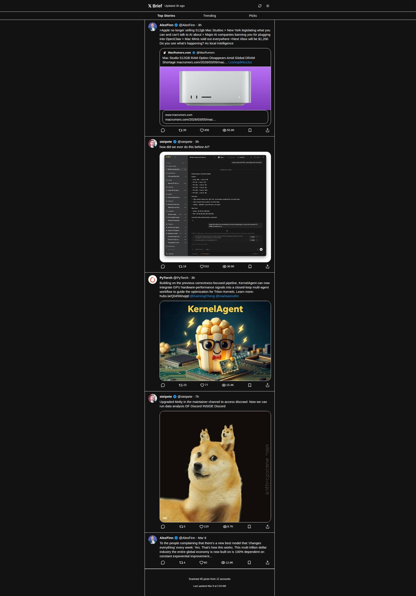
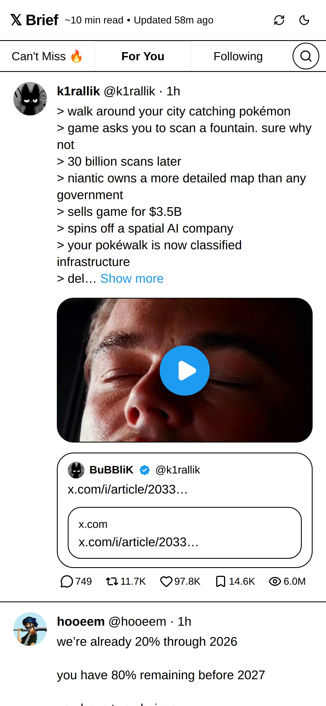

# X Brief

[](https://github.com/steve-cooks/x-brief/actions/workflows/test.yml)
[](https://www.python.org/downloads/)
[](https://opensource.org/licenses/MIT)

> Your read-only X account that stops you from doomscrolling.

> Replace 2 hours of compulsive scrolling with a 5-minute brief.

X Brief is an **anti-scrolling-addiction tool** for X/Twitter.
It is **not** a generic news aggregator.

The goal is simple:
- get the most useful posts from your timeline,
- avoid dopamine-driven feed loops,
- close the app and move on with your day.







---

## Why this exists

Most feeds reward attention capture, not usefulness.
X Brief flips that:
- fewer posts,
- higher information density,
- clear stopping point (`~X min read`).

If nothing important happened, that is a good outcome too.

---

## How it works

```text
scan timeline JSON
   → score (engagement + information density)
   → curate (topic clustering + quality gates)
   → enrich (full text, media, quotes, link cards)
   → serve (web UI + JSON API)
```

Pipeline output:
- `data/latest-briefing.json`
- `data/pipeline-status.json`
- `data/brief_history.json` (dedup window + re-emergence tracking)

---

## The 3-tab briefing system (v2)

### 1) TL;DR ⚡
**Philosophy:** a quick AI-generated summary of the most important things happening.

Instead of showing individual posts, this tab generates a summary paragraph from the highest-signal content. Quality gates filter what feeds the summary:
- density score >= 3
- likes >= 10,000 and views >= 500,000
- quality ratio `(bookmarks + replies) / likes >= 5%`
- max 1 post per author

If nothing noteworthy happened: **"Nothing major happened. Go live your life. ✌️"**

### 2) For You 📌
**Philosophy:** useful posts tailored to your interests, with breadth.

- Interest-matched
- Topic-clustered (one winner per topic)
- Max 1 post per author
- Scored to favor substance

### 3) Following 👥
**Philosophy:** balanced updates from people you intentionally track.

- Source: following feed or tracked account fallback
- Lower engagement floor
- Topic-clustered for variety

---

## Scoring model

### Engagement score (normalized per run)

```text
raw =
  likes*1.0 + reposts*2.0 + replies*1.5 + bookmarks*3.0 + views*0.01
```

Why these weights:
- **Bookmarks x3**: strongest usefulness signal
- Reposts/replies > likes: endorsement + discussion
- Views lightly weighted: cheap and passive

### Information density score (0-20)

Bonuses:
- external link +3
- X article +5
- thread +4
- long form (>200 chars +2, >500 chars additional +2)
- media +1

Penalty:
- short hot take (<100 chars, no link/media) -2

### Final tab weights

- **Can't Miss:** `0.7 engagement + 0.3 density`
- **For You:** `0.4 engagement + 0.6 density`
- **Following:** `0.5 engagement + 0.5 density`

### Re-emergence

A previously briefed post can re-enter **Can't Miss** if engagement jumps 10x.

---

## Quick start

## 1) Backend (Python)

```bash
git clone https://github.com/steve-cooks/x-brief.git
cd x-brief

python3 -m venv .venv
source .venv/bin/activate
pip install -e .
```

Create config:

```bash
cp configs/example.json configs/my-config.json
```

Run pipeline from scans:

```bash
python -m x_brief.pipeline configs/my-config.json --from-scans --hours 36
# or
x-brief run --config configs/my-config.json --hours 36
```

## 2) Frontend (Next.js)

```bash
cd web
npm install
npm run dev
```

Open: `http://localhost:3000`

---

## Configuration

Main config file fields:

- `x_handle`: optional personal reference
- `tracked_accounts`: accounts that should influence relevance
- `recent_interests`: your topical filters
- `delivery`: reserved for downstream delivery integrations
- `briefing_schedule`: label for your cadence

Example (`configs/example.json`):

```json
{
  "x_handle": "your_handle",
  "tracked_accounts": ["openai", "anthropicai", "vercel"],
  "recent_interests": ["AI & Tech", "Startups & Business", "Design & UI"],
  "delivery": { "type": "local" },
  "briefing_schedule": "daily"
}
```

### Environment variables (optional)

- `X_BRIEF_SCAN_DIR` — where scan JSON files are read from
- `X_BRIEF_DATA_DIR` — where briefing/status/history files are written/read

---

## Scan input format

Each scan file should contain:
- `scan_time` (ISO timestamp)
- one or more arrays with posts (`posts`, `viral_alerts`, `notable_posts`)

Each post should include a valid X status URL (`/status/<id>`) or article URL.

See full setup + examples in [`SETUP.md`](./SETUP.md).

---

## Automation (cron)

Run every 4 hours:

```cron
5 */4 * * * cd /home/you/projects/x-brief && . .venv/bin/activate && python -m x_brief.pipeline configs/my-config.json --from-scans --hours 48 >> /home/you/projects/x-brief/data/pipeline.log 2>&1
```

Typical schedule:
1. browser/agent writes scan JSON into `timeline_scans/`
2. cron runs pipeline
3. web UI auto-refreshes from latest JSON

---

## Self-hosting with OpenClaw

X Brief was built to run with [OpenClaw](https://openclaw.com) — an AI agent platform that can automate browser tasks. Here's how the full automated pipeline works:

### How scanning works

An OpenClaw agent opens a real browser, logs into your X account, and scrolls through your For You and Following feeds. It extracts posts and saves them as JSON scan files. The pipeline then processes those scans into a briefing.

### Setting up the cron job

1. **Create an OpenClaw cron job** that runs every 4 hours. Copy and paste this command:

   ```bash
   openclaw cron add \
     --name "X Timeline Scan" \
     --cron "0 */4 * * *" \
     --agent rabbit \
     --session isolated \
     --announce \
     --message "Scan the X timeline using the browser (profile='openclaw'). IMPORTANT: At the very start of every scan, navigate to x.com/home and do a HARD REFRESH (navigate away then back, or reload the page) to ensure X serves fresh content. After refreshing, scroll the For You and Following tabs, collect posts. Run the x-brief pipeline to score and curate them. After completing the scan and pipeline, write a TL;DR — one sentence that summarizes what is happening on the timeline right now. Write it like you are texting a friend: casual, opinionated, specific. Examples: 'OpenClaw is having a massive moment — steipete at Microsoft Build, Ollama shipped native support, and some dude used Claude to find 6K in landlord overcharges' or 'Slow day — just people arguing about vibe coding again.' Then save the TL;DR to the briefing JSON file at ~/projects/x-brief/data/latest-briefing.json by reading the file, updating the tldr field, and writing it back."
   ```

2. **Create a wrapper script** from the included template:
   ```bash
   cp scripts/trigger-scan.example.sh scripts/trigger-scan.sh
   chmod +x scripts/trigger-scan.sh
   # Edit scripts/trigger-scan.sh with your gateway token and cron job ID
   ```

3. **Set environment variables** in `web/.env.local`:
   ```
   XBRIEF_SCAN_COMMAND=/path/to/your/trigger-script.sh
   XBRIEF_CRON_JOB_ID=your-cron-job-id
   OPENCLAW_GATEWAY_TOKEN=your-gateway-token
   ```

4. The web UI scan button calls your wrapper script to trigger an on-demand scan (with a 15-minute cooldown).

### Config file setup

```bash
cp configs/example.json configs/my-config.json
```

Edit with your details:
- **`tracked_accounts`**: X handles you follow and want prioritized
- **`recent_interests`**: topics you care about — **this is critical**. Without it, the For You tab will be empty because no posts will match your interests.

### Will this get me banned on X?

Unlikely. The agent only reads your timeline — it never likes, reposts, follows, or posts. It's the same as scrolling your feed, just automated. That said, use at your own risk.

---

## Project structure

```text
x_brief/        Python ingestion/scoring/curation/pipeline
tests/          Pytest coverage
configs/        Example configuration
timeline_scans/ Input scan snapshots
data/           Generated briefing artifacts
web/            Next.js UI + API routes
```

---

## Tech stack

- **Backend:** Python 3.10+, Click, Pydantic
- **Frontend:** Next.js (App Router), React, TypeScript, Tailwind, shadcn/ui
- **Storage:** local JSON files (no DB required)
- **Enrichment:** X syndication endpoint for full post text, media, quote tweets, link cards, and avatars

---

## Contributing

We welcome contributions that improve:
- curation quality
- anti-addiction UX
- reliability and docs

Please read [`CONTRIBUTING.md`](./CONTRIBUTING.md) first.

Before opening a PR:

```bash
python3 -m pytest tests/ -q
cd web && npm run build
```

---

## License

MIT — see [`LICENSE`](./LICENSE).
