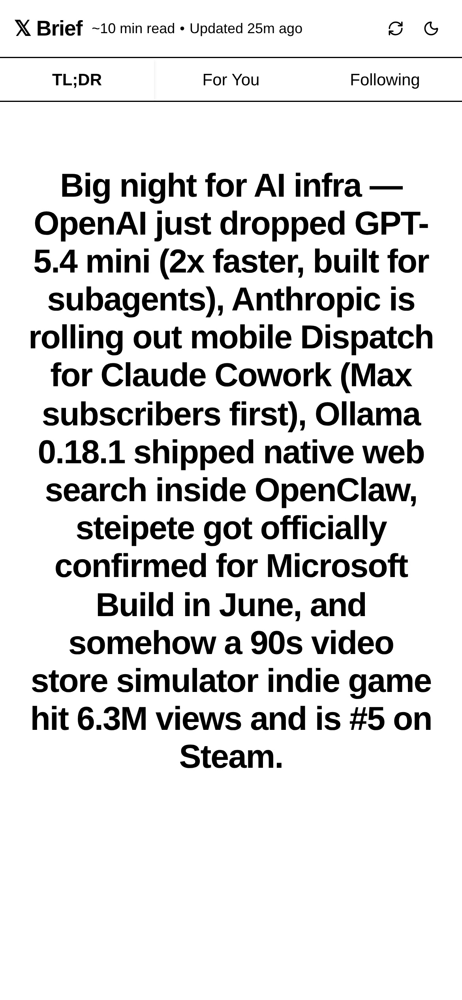
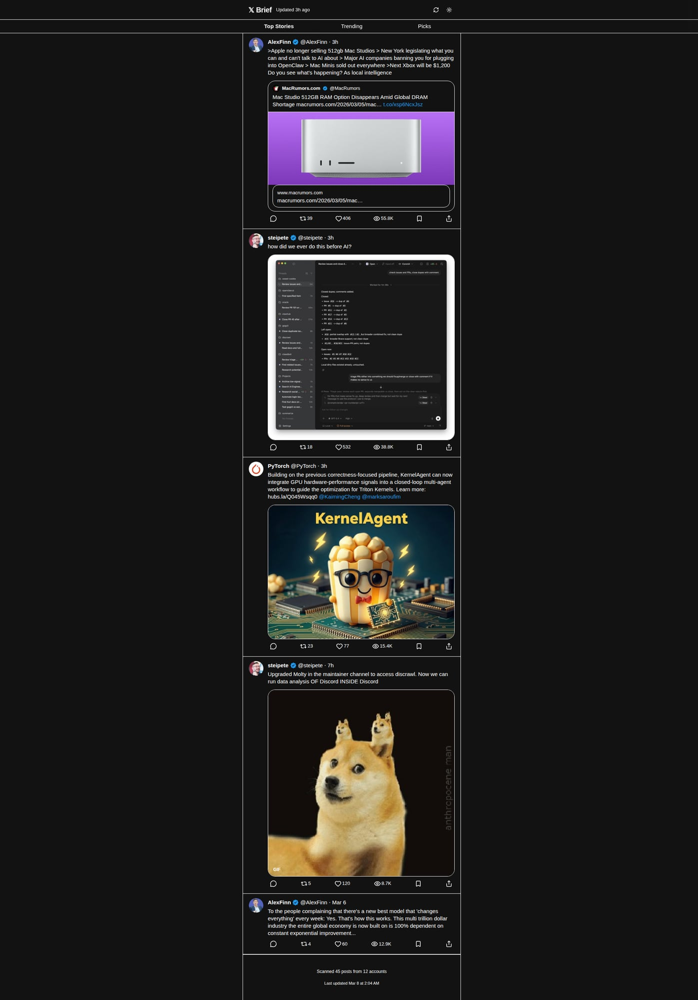
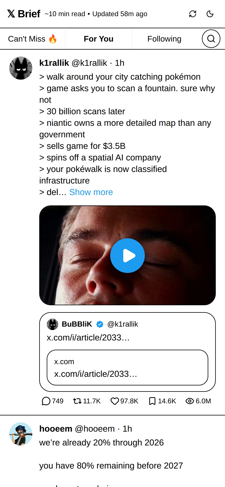

# X Brief

[](https://github.com/steve-cooks/x-brief/actions/workflows/test.yml)
[](https://www.python.org/downloads/)
[](https://opensource.org/licenses/MIT)

> Your read-only X account that stops you from doomscrolling.

> Replace 2 hours of compulsive scrolling with a 5-minute brief.

X Brief turns your noisy X timeline into a short, high-signal daily briefing. Substance over dopamine.







---

## How it works

An OpenClaw cron job runs Rabbit (a browser agent) every 4 hours to scan your X timeline. Posts are ingested, enriched, and summarized automatically.

Pipeline:

```text
OpenClaw cron (every 4h)
   → Rabbit scrapes X timeline (For You + Following tabs)
   → posts_store.py ingests posts to data/posts.json (deduped)
   → enrich_videos.py enriches video posts via yt-dlp
   → x_brief.tldr generates AI TL;DR → data/latest-briefing.json
   → Web UI at :3000 serves posts with seen/unseen tracking
   → Midnight reset clears posts.json for a fresh daily start
```

Posts are filtered to the last 24 hours of scans only. No manual scan button — scans happen automatically via cron.

---

## The 3-tab briefing

### TL;DR ⚡
AI-generated one-sentence summary of your timeline right now. Casual, opinionated, specific.

### For You 📌
Posts from your X "For You" tab — unseen only. Disappear once read.

### Following 👥
Posts from people you follow — unseen only. Disappear once read.

Seen state is tracked server-side in `data/read-state.json` and client-side in localStorage.

---

## Quick start

### Backend

```bash
git clone https://github.com/steve-cooks/x-brief.git
cd x-brief
python3 -m venv .venv
source .venv/bin/activate
pip install -e .
```

### Frontend

```bash
cd web
npm install
npm run dev
```

Open: `http://localhost:3000`

---

## Automation with OpenClaw

X Brief is designed to run fully automated with [OpenClaw](https://openclaw.com).

Set up an OpenClaw cron job that runs every 4 hours with the Rabbit agent. See `CRON_INSTRUCTIONS.md` for the exact cron message to use.

### Key commands

```bash
# Ingest a scan file
python3 -m x_brief.posts_store --ingest timeline_scans/2026-03-27-04-foryou.json --tab foryou

# Regenerate TL;DR
python3 -m x_brief.tldr

# Midnight reset (clears posts.json)
python3 -m x_brief.posts_store --clear

# Run tests
python3 -m pytest tests/ -q

# Build web UI
cd web && npm run build
```

### Environment variables

- `X_BRIEF_DATA_DIR` — data directory (default: `data/`)
- `ANTHROPIC_API_KEY` — required for TL;DR generation

---

## Data files

- `data/posts.json` — all ingested posts with seen/unseen state
- `data/latest-briefing.json` — current TL;DR + metadata
- `data/read-state.json` — server-side seen post IDs
- `timeline_scans/*.json` — raw scan files from Rabbit

---

## Project structure

```text
x_brief/        Python ingestion + TL;DR pipeline
tests/          Pytest coverage
timeline_scans/ Input scan snapshots from Rabbit
data/           Generated briefing artifacts
web/            Next.js UI + API routes
scripts/        Enrichment scripts (enrich_videos.py)
```

---

## Tech stack

- **Backend:** Python 3.10+, Click, Pydantic
- **Frontend:** Next.js (App Router), React, TypeScript, Tailwind, shadcn/ui
- **Storage:** Local JSON files (no DB required)
- **Automation:** OpenClaw + Rabbit agent

---

## License

MIT — see [LICENSE](./LICENSE).
